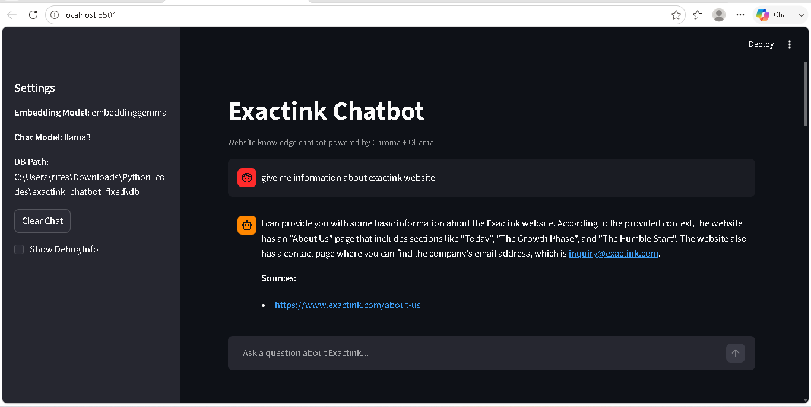
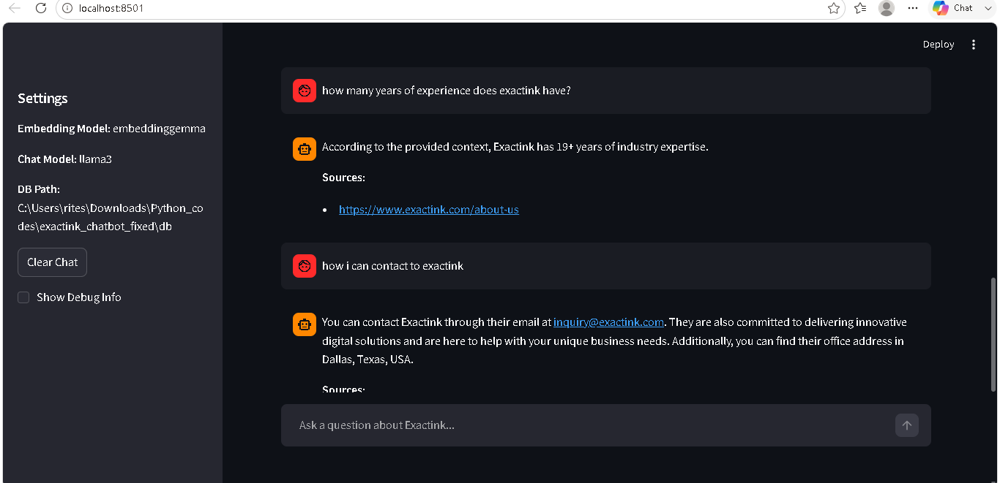

#  Exactink Chatbot (RAG-based AI Project)

##  Overview

This project is a RAG (Retrieval-Augmented Generation) based chatbot that answers user queries using data scraped from the Exactink website.

Instead of generating random responses, the chatbot retrieves relevant information from a knowledge base and generates accurate, context-based answers.

---

##  Features

* Website scraping & data cleaning
* Knowledge base creation (JSON format)
* Text chunking & embeddings
* Vector database using ChromaDB
* Local LLM using Llama 3 (via Ollama)
* Interactive chatbot UI using Streamlit

---

##  Tech Stack

* Python
* LangChain
* ChromaDB
* Ollama
* Streamlit
* BeautifulSoup

---

##  Project Workflow

1. Scrape website data
2. Clean & structure the data
3. Split text into chunks
4. Generate embeddings
5. Store in vector database
6. Retrieve relevant chunks
7. Generate answer using LLM

---

##  Installation & Setup

### 1. Clone the repository

```bash
git clone https://github.com/YOUR_USERNAME/Chat_system.git
cd Chat_system
```

---

### 2. Create virtual environment

```bash
python -m venv venv
```

Activate:

* Windows:

```bash
venv\Scripts\activate
```

* Linux/Mac:

```bash
source venv/bin/activate
```

---

### 3. Install dependencies

```bash
pip install -r requirements.txt
```

---

### 4. Install Ollama and Models

Download and install Ollama, then run:

```bash
ollama pull llama3
ollama pull embeddinggemma
```

---

### 5. Run the application

```bash
streamlit run app.py
```

---

##  Build Vector Database (if needed)

```bash
python chunk.py
```

---

##  Limitations

* Uses local LLM (not cloud scalable)
* Basic retrieval (no advanced reranking)
* Static data (no real-time updates)

---

##  Future Improvements

* Advanced retrieval & reranking
* Cloud deployment support
* API-based LLM integration
* Admin dashboard for updating data

---

##  Summary

This project demonstrates how to build a domain-specific AI chatbot using RAG architecture, combining retrieval and generation for accurate and reliable responses.

## Snapshot of UI



